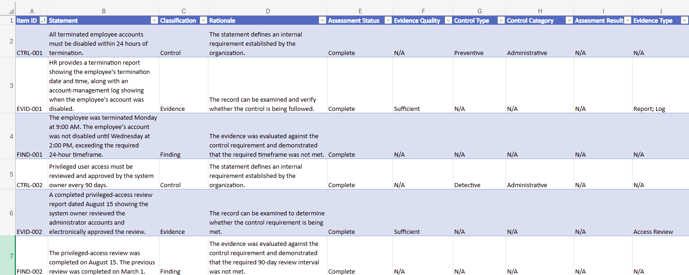
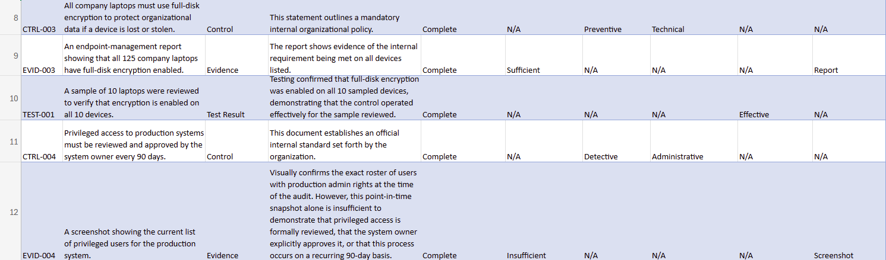
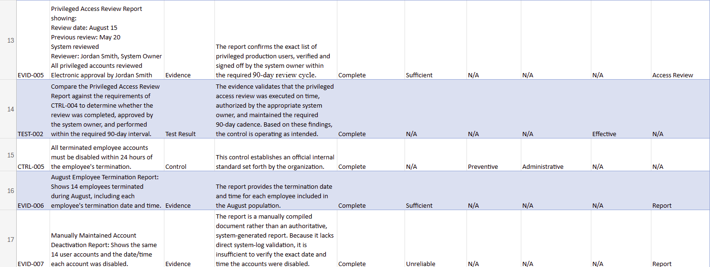
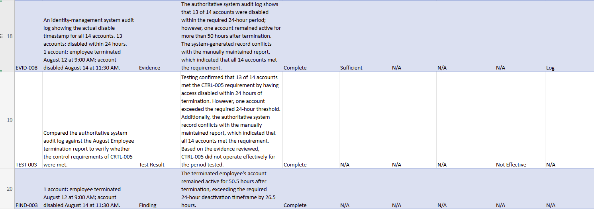

# Lab 03 — Control, Evidence, or Finding? + Excel

## Overview

This lab focused on analyzing common components of a GRC control assessment and documenting the results in a structured Excel tracker.

I evaluated controls, evidence, test results, and findings while also assessing evidence quality, control type, control category, assessment results, and evidence types.

The lab was designed to practice moving beyond simple GRC definitions and applying evidence-based reasoning to realistic control-assessment scenarios.

---

## Skills Practiced

- Control identification and classification
- Evidence evaluation
- Evidence sufficiency and reliability analysis
- Control testing
- Findings identification
- Preventive vs. detective control classification
- Administrative vs. technical control classification
- Evidence-type classification
- Excel tables
- Excel Data Validation and dropdown lists
- GRC documentation
- Evidence-based control assessment

---

## Assessment Workflow

The lab followed the basic control-assessment process:

**Control → Evidence → Test → Assessment Result → Finding**

### Control
Defines what the organization requires to occur.

### Evidence
Provides information that can be examined to determine whether the control requirement was followed.

### Test Result
Documents the outcome of evaluating the evidence against the control requirement.

### Assessment Result
Determines whether the control operated effectively for the period tested.

### Finding
Documents a condition where the control requirement was not met.

---

## Excel Control Assessment Tracker

I created a structured Excel tracker containing the following fields:

| Field | Purpose |
|---|---|
| Item ID | Unique identifier for each assessment item |
| Statement | Control, evidence, test, or finding being evaluated |
| Classification | Identifies the type of assessment item |
| Rationale | Documents the reasoning supporting the classification |
| Assessment Status | Tracks completion of the assessment |
| Evidence Quality | Evaluates whether evidence is sufficient and reliable |
| Control Type | Identifies preventive or detective controls |
| Control Category | Identifies administrative or technical controls |
| Assessment Result | Records whether the tested control was effective |
| Evidence Type | Identifies the type of evidence reviewed |

---

## Key Assessment Scenario

One control required terminated employee accounts to be disabled within **24 hours of termination**.

The evidence package included:

- An employee termination report
- A manually maintained account-deactivation report
- An authoritative identity-management system audit log

The manually maintained report indicated that all 14 terminated employee accounts were disabled within the required timeframe.

However, the authoritative system audit log showed that:

- **13 of 14 accounts were disabled within 24 hours**
- **1 account remained active for 50.5 hours after termination**
- The account exceeded the required timeframe by **26.5 hours**

Because the system-generated audit log was considered more reliable than the manually maintained report, the control was assessed as:

**Not Effective**

A finding was documented for the account that exceeded the 24-hour requirement.

---

## Evidence Quality Analysis

This lab demonstrated that the existence of evidence does not automatically mean that the evidence is sufficient or reliable.

For example:

- A screenshot of the current privileged-user list showed who had access at a specific point in time but did not prove that the required periodic access review occurred.
- A manually maintained report contained relevant information but conflicted with the authoritative system-generated audit log.
- A completed privileged-access review provided evidence that the system owner reviewed and approved privileged access within the required review period.

Evidence was therefore evaluated based on its ability to support the specific control requirement being tested.

---

## Evidence Types Identified

Evidence reviewed during the lab included:

- Reports
- System logs
- Screenshots
- Access reviews
- Evidence packages containing multiple artifact types

---

## Key Takeaways

This lab reinforced that GRC control assessment requires more than verifying that documentation exists.

Effective assessment requires determining:

1. What the control requires
2. What evidence supports the control
3. Whether the evidence is sufficient and reliable
4. Whether testing demonstrates that the control operated effectively
5. Whether a finding should be documented

The lab also demonstrated how Excel can be used to organize control assessments and maintain consistent GRC documentation.

---

## Tools Used

- Microsoft Excel
- Excel Tables
- Data Validation
- Dropdown Lists
- Structured GRC Assessment Tracker

---

## Portfolio Artifacts

- GRC Control Assessment Tracker
- Control and evidence classifications
- Evidence-quality assessments
- Control testing results
- Documented control finding
- Evidence screenshots

---

## Evidence Screenshots

The following screenshots show the completed GRC Control Assessment Tracker and the analysis performed during the lab.

### Control Assessment Tracker — Part 1

### Control Assessment Tracker — Part 2

### Control Assessment Tracker — Part 3

### Control Assessment Tracker — Part 4

